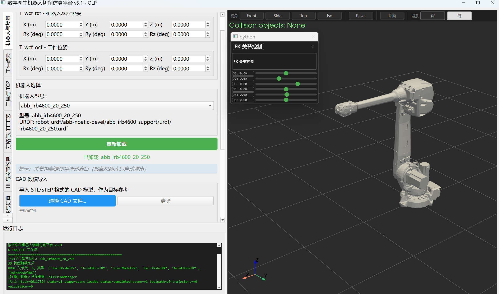
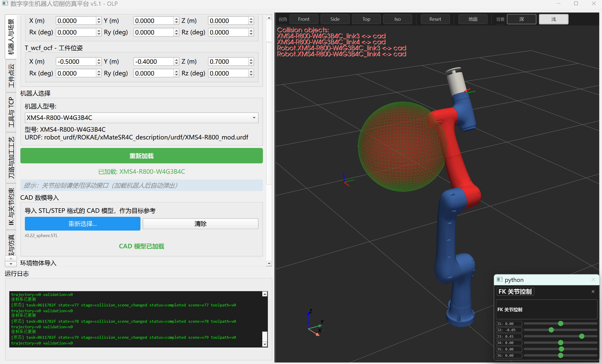
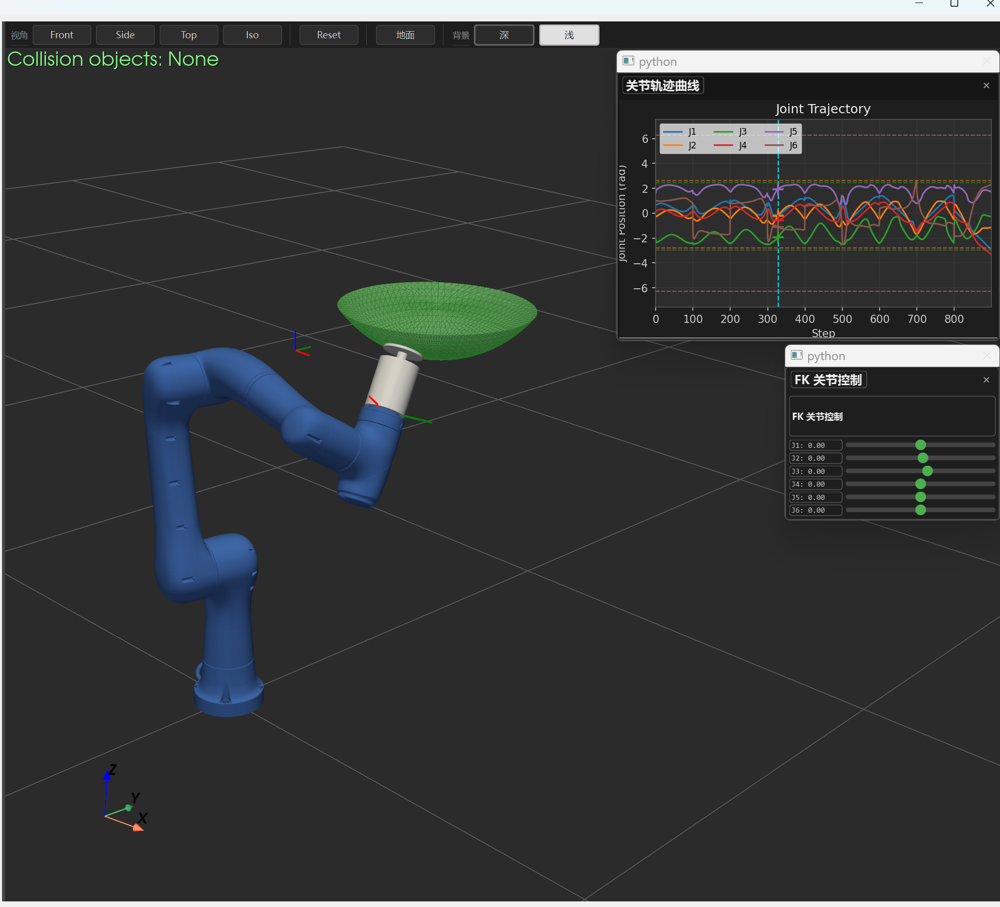
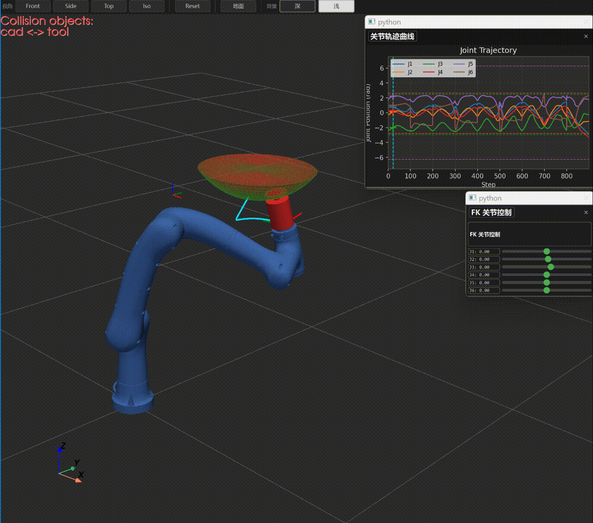

# Robot OLP Toolkit

> A public, portfolio-ready offline-programming (OLP) toolkit for **robotic
> sanding, polishing, deburring, and other surface-finishing tasks**, built
> with **Pinocchio**, **PyVista**, and **PySide6**.


[](LICENSE)

Public repository: [github.com/bucciarati316/robot_sanding_olp_toolkit](https://github.com/bucciarati316/robot_sanding_olp_toolkit)

## Runtime environment

The public workflow is maintained and demonstrated on **Windows with
PowerShell**, using **Python 3.10** and a Conda environment created from
[`environment.yml`](environment.yml). Pinocchio and the collision bindings
contain native components, so the Windows/Conda setup is the supported path for
the GUI and URDF toolbox. Linux and macOS are not the tested target environments
for this public subset.

Robot OLP Toolkit packages the reusable parts of a research-oriented robot
simulation workflow for robotic sanding and surface finishing. Starting from a
robot URDF and a workpiece represented by CAD or point-cloud data, it helps
organize tool/TCP setup, surface-following toolpaths, continuous inverse
kinematics (IK), collision diagnostics, and trajectory playback. It is a
**simulation and engineering-validation toolkit**, not a robot controller or a
safety-certified motion planner.

## Target task: robotic sanding and surface finishing

The public subset is organized around this practical sequence:

1. Load a robot URDF and a CAD/point-cloud workpiece into the scene.
2. Configure the sanding tool, flange, TCP offset, and contact orientation.
3. Generate or import a surface-following toolpath with process parameters.
4. Solve a continuous IK path while monitoring joint limits and branch changes.
5. Re-check interpolated collision edges, time parameterization, and TCP/FK
   error before playback or export.

This structure also supports polishing, deburring, and similar tool-surface
tasks where end-effector orientation and contact path matter as much as
position.

## What is included

- **URDF toolbox** — load a URDF, compile xacro when the local ROS/xacro tools
  are available, inspect mesh references, and convert mesh assets for preview.
- **Sanding-oriented GUI workflow** — robot/workpiece setup, abrasive tool and
  TCP configuration, toolpath and IK panels, trajectory playback, and
  collision diagnostics.
- **Reusable Python modules** — Pinocchio kinematics, pose solving, trajectory
  interpolation, FCL-based collision services, rendering helpers, and planner
  adapters.
- **A public demo robot** — an authored, mesh-free six-axis URDF that keeps the
  default registry runnable without shipping a vendor robot model.
- **README evidence** — screenshots and a GIF showing the GUI, collision
  highlighting, sanding trajectory plots, and playback.

## Visual demo

The following assets are GUI evidence from the source project. They show a
robot scene, collision diagnostics, a sanding toolpath with joint curves, and
animated playback. They are not claims of a certified robot trajectory and do
not include the vendor model packages used to produce the screenshots.

<p align="center">
  
</p>

<p align="center">
  
</p>

<p align="center">
  
</p>

<p align="center">
  
</p>

## Quick start on Windows

The most reproducible route is Conda, because Pinocchio and its collision
bindings contain native components:

```powershell
conda env create -f environment.yml
conda activate robot-olp-toolkit

# Main seven-step GUI
python -m main_app.main_app

# URDF toolbox window
python -m robot_toolkit_main.robot_toolkit_main
```

If the environment already exists, the local helper performs the same checks:

```powershell
.\scripts\activate_env.ps1
python -m main_app.main_app
```

Optional utilities:

```powershell
# Generate small local STL primitives under generated_stl/ (ignored by Git)
python .\scripts\generate_stl.py

# Launch the point-cloud helper
python -m apps.point_cloud_generator
```

The `requirements-public.txt` file lists the Python-side packages. On a
different platform, install the Pinocchio/HPP-FCL stack using the equivalent
native packages for that platform before launching the GUI.

## GUI tour

| Area | Purpose | First action |
| --- | --- | --- |
| Robot and scene | Select the robot, coordinate frames, CAD, and environment objects | Load the bundled `Demo Six Axis` URDF |
| Workpiece / point cloud | Import the sanding surface, filter, crop, and align data | Skip this page for a URDF-only smoke test |
| Tool and TCP | Configure the abrasive tool, flange, and TCP offsets | Check the contact/tool axes in the 3-D view |
| Toolpath and process | Choose sanding/process parameters and generate a surface path | Use a small path before a full workpiece |
| IK and joint constraints | Solve a continuous joint path and inspect limits | Provide a pose/path CSV or use the previous page |
| Trajectory and playback | Time-parameterize, validate, play back, and export | Validate before treating a path as usable |
| Collision and diagnostics | Build collision geometry and report contacts | Rebuild the scene, then run the collision test |

The GUI is intentionally fail-closed around engineering checks: optimizer
convergence, a few collision-free samples, or a visually smooth playback are
not sufficient evidence for real hardware execution. Validate FK/TCP error,
joint margins, branch continuity, dynamics/time parameterization, and
interpolated collision edges for the target scene.

## Typical sanding workflow

For a first surface-finishing experiment, use a small CAD patch or point-cloud
region rather than a complete workpiece. Confirm the following in order:

- the tool frame points along the intended sanding direction and the TCP is at
  the abrasive contact point;
- adjacent surface poses produce a continuous joint branch instead of sudden
  flips;
- the tool, robot links, workpiece, and environment remain collision-free at
  the chosen interpolation resolution;
- the final playback shows the intended contact motion, not merely a reachable
  sequence of isolated poses.

## URDF toolbox workflow

1. Start `python -m robot_toolkit_main.robot_toolkit_main`.
2. Select a URDF (the bundled smoke-test file is
   `examples/assets/urdf/demo_six_axis.urdf`).
3. If your project uses xacro, compile it with the local xacro/ROS toolchain.
4. Inspect mesh references and use the converter/preview actions for licensed
   mesh-based robots.
5. Load the same URDF in the main GUI to check kinematics and scene behavior.

The preview code understands mesh references; primitive-only URDFs are still
valid Pinocchio inputs and use the renderer's simplified fallback model.

## Public project boundary

This is a curated public subset of a larger private workspace. The repository
contains source modules, the GUI, public documentation, an authored demo URDF,
and visual evidence. It intentionally excludes private logs, experimental
datasets, generated validation artifacts, editor settings, and vendor robot
URDF/mesh packages. See [docs/THIRD_PARTY.md](docs/THIRD_PARTY.md) before
adding external assets.

## Project structure

```text
core/                 # Reusable kinematics, IK, toolpath, and pipeline modules
main_app/             # PySide6 seven-step GUI
robot_toolkit_main/   # URDF/xacro/mesh toolbox GUI
render_engine/        # PyVista robot and scene rendering
collision/            # FCL collision services and state validity helpers
trajectory/           # Planning, validation, and export adapters
algorithms/           # IK, slicing, and optimization algorithms
plotting/             # Trajectory plots and limit helpers
apps/                 # Optional point-cloud utility
scripts/              # Environment and STL helper scripts
examples/assets/      # Authored, mesh-free public URDF
docs/evidence/        # README screenshots and GIF
tests/                # Public layout/import smoke tests
```

## Verification

After installing the environment, run the lightweight public checks:

```powershell
python -m pytest tests -q
```

The checks validate the public URDF, package boundaries, and imports. Full
trajectory and collision acceptance still depends on the selected robot,
licensed CAD, and the native Pinocchio/FCL versions installed on the machine.

## License

The original source code, documentation, and authored demo URDF are released
under the [MIT License](LICENSE). The files in `docs/evidence/` are GUI visual
evidence; if a screenshot depicts a third-party robot or CAD asset, that asset
is not relicensed by this repository. External URDFs, meshes, point clouds,
and other assets loaded by a user keep their own licenses and attribution
requirements.
